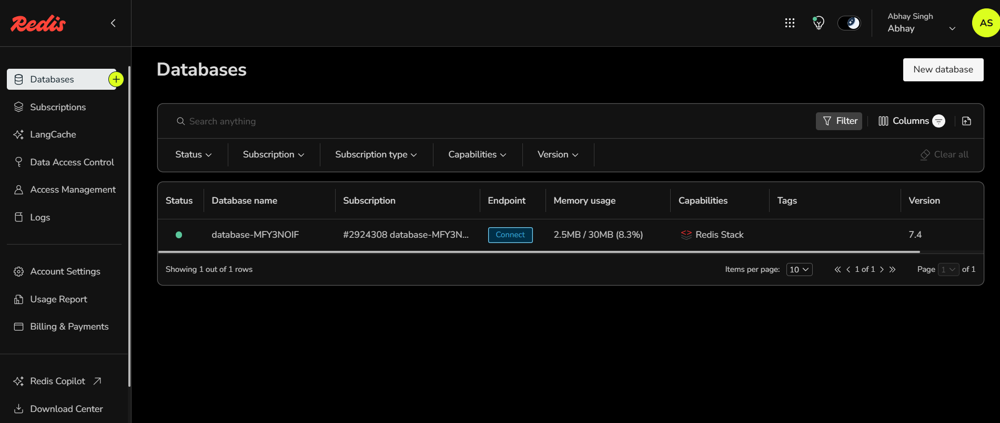
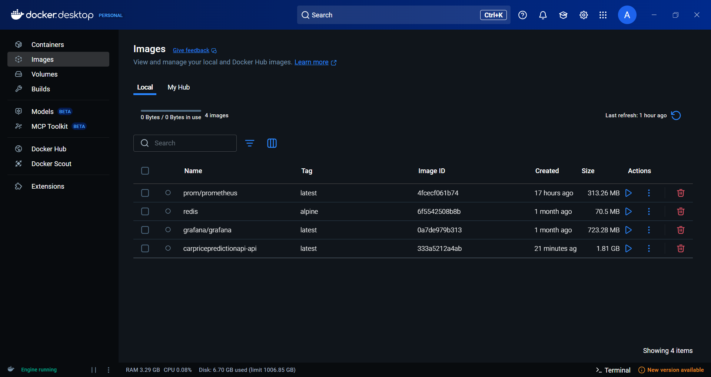

# Car Price Prediction with Redis · Prometheus · Grafana

**Lightweight ML API + caching + monitoring + authentication**

A FastAPI-based car price prediction service that demonstrates a production-like setup: model inference served via an API, Redis for caching predictions, JWT-based authentication, API key validation, and Prometheus + Grafana for metrics and observability.

## 📸 Project Demo  

|  |  |  
|---------------------------------|---------------------------------|  
|  |  |  
|  |  | 

---

## Table of contents

* [Overview](#overview)
* [Key features](#key-features)
* [Architecture](#architecture)
* [Tech stack](#tech-stack)
* [Prerequisites](#prerequisites)
* [Quick start (Docker)](#quick-start-docker)
* [Running locally (without Docker)](#running-locally-without-docker)
* [API endpoints](#api-endpoints)
* [Authentication & Security](#authentication--security)
* [Caching with Redis](#caching-with-redis)
* [Monitoring with Prometheus & Grafana](#monitoring-with-prometheus--grafana)
* [Extending the project](#extending-the-project)
* [License](#license)

---

## Overview

This repository contains a car price prediction microservice built with FastAPI. It showcases:

* Loading a trained model for price prediction.
* A REST API for single predictions.
* Redis caching of requests to reduce inference latency.
* Authentication using JWT tokens and API keys.
* Exposed Prometheus metrics for observability.
* Example Grafana dashboard for visualization.

---

## Key features

* **FastAPI endpoints** for prediction, authentication, and health checks.
* **JWT Authentication & API Key security** for protected routes.
* **Redis caching** with TTL for repeated requests.
* **Prometheus metrics** (request counts, latencies, cache hits/misses).
* **Grafana dashboards** to visualize service health and model performance.
* **Docker Compose setup** for easy orchestration.

---

## Architecture

```
[Client] --> [FastAPI App] --> [Model]
                    |
                    +--> [Redis cache]
                    +--> [Auth (JWT + API key)]
                    +--> [/metrics endpoint]

Prometheus <-- scrapes -- [FastAPI /metrics]
Grafana <-- queries -- Prometheus
```

---

## Tech stack

* **FastAPI** — REST API
* **Redis** — Caching
* **Prometheus** — Metrics collection
* **Grafana** — Dashboards
* **JWT & API keys** — Authentication & authorization
* **Docker & Docker Compose** — Orchestration
* **scikit-learn / joblib** — ML model

---

## Prerequisites

* Docker & Docker Compose
* Or: Python 3.9+, Redis, Prometheus, Grafana

---

## Quick start (Docker)

```bash
git clone https://github.com/AbhaySingh71/Car-price-prediction-with-Redis-prometheus-grafana.git
cd Car-price-prediction-with-Redis-prometheus-grafana
docker compose up --build
```

Services:

* FastAPI app → `http://localhost:8000`
* Redis → `localhost:6379`
* Prometheus → `http://localhost:9090`
* Grafana → `http://localhost:3000`

---

## Running locally (without Docker)

```bash
python -m venv venv
source venv/bin/activate   # Linux/macOS
venv\Scripts\activate     # Windows
pip install -r requirements.txt
uvicorn app.main:app --reload --host 0.0.0.0 --port 8000
```

Visit `http://localhost:8000/docs` for Swagger UI.

---

## API endpoints

* `POST /login` — Get JWT token (default: `admin/admin`)【18†routes\_auth.py】
* `POST /predict` — Predict car price (JWT + API Key required)【19†routes\_predict.py】
* `GET /health` — Health check
* `GET /metrics` — Prometheus metrics

**Example request:**

```bash
curl -X POST "http://localhost:8000/predict" \
  -H "Content-Type: application/json" \
  -H "Authorization: Bearer <JWT_TOKEN>" \
  -H "api-key: <API_KEY>" \
  -d '{"company":"Toyota","year":2015,"owner":"First","fuel":"Petrol","seller_type":"Dealer","transmission":"Manual","km_driven":45000,"mileage_mpg":18,"engine_cc":1800,"max_power_bhp":138,"torque_nm":173,"seats":5}'
```

Response:

```json
{"predicted_price": "450,000.00"}
```

---

## Authentication & Security

* **Login endpoint** issues JWT tokens.
* **API key validation** required for predictions.
* Both JWT and API key must be provided in headers:

  * `Authorization: Bearer <JWT>`
  * `api-key: <API_KEY>`

---

## Caching with Redis

* Predictions are cached with keys derived from request payloads.
* TTL configurable via environment variables.
* Prometheus tracks `cache_hits` and `cache_misses`.

---

## Monitoring with Prometheus & Grafana

* `/metrics` exposes Prometheus metrics.
* Prometheus scrapes metrics at `http://app:8000/metrics`.
* Grafana dashboards visualize:

  * Request rate & latency
  * Cache hit ratio
  * Error rates

---

## Extending the project

* Add user registration & database-backed auth.
* Add batch predictions.
* Support multiple ML models with versioning.
* CI/CD with tests & deployment pipeline.


---

## License

MIT License
